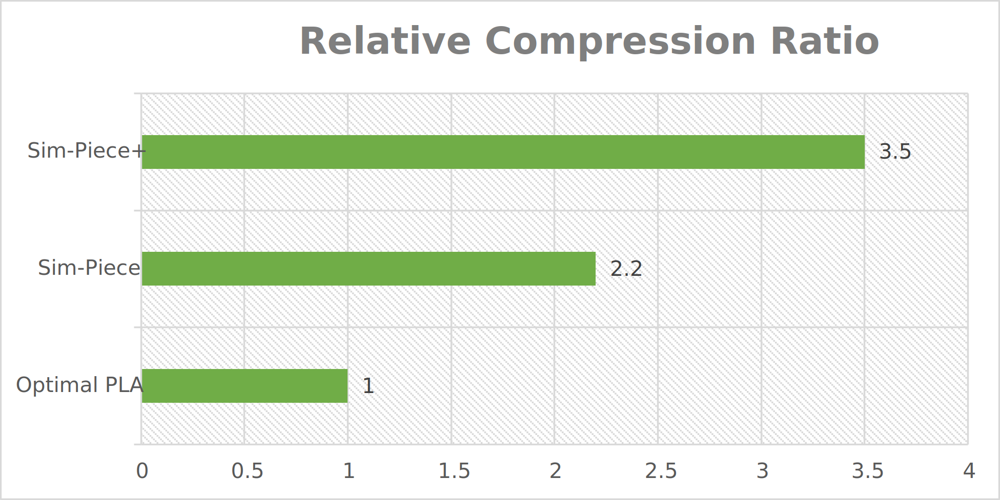

# Sim-Piece
*Sim-Piece: Highly Accurate Piecewise Linear Approximation through Similar Segment Merging*

Publication:  [Proceedings of the VLDB Endowment](http://vldb.org/pvldb/volumes/16/paper/Sim-Piece%3A%20Highly%20Accurate%20Piecewise%20Linear%20Approximation%20through%20Similar%20Segment%20Merging)  
Source Code: [GitHub](https://github.com/xkitsios/Sim-Piece/)

## Description
Sim-Piece is a time-series lossy data compressor influenced by PLA. If you are interested in lossless time-series compression you can take a look at our CHIMP algorithm available at [https://github.com/panagiotisl/chimp](https://github.com/panagiotisl/chimp).

Sim-Piece utilizes a user-defined maximum absolute error bound to generate a remarkably compact binary representation of a time series. Sim-Piece is particularly suitable for applications that need to accommodate large time series datasets even when the acceptable error threshold is very small.

The algorithm consists of two stages. During the first stage, an intermediate angle-based PLA representation is constructed. This involves generating disjoint PLA segments, each accompanied by a quantized starting point and a range of allowable slopes, determined by the error threshold. In the second stage, these intermediate segments are merged and jointly represented in the final output.

During the merging phase, the algorithm calculates the minimum number of shared groups possible. This process leads to a highly compressed representation that is considerably smaller than what an optimal PLA description computed for the same maximum error threshold could achieve.

The provided repository also includes a newer algorithm called Sim-Piece+, which builds upon the original Sim-Piece technique by introducing variable encoding of the PLA coefficients. This enhancement results in an even smaller representation size.

The following graph illustrates the performance of these algorithms on a diverse range of real datasets, comparing them to the optimal PLA representation for the same maximum error bound.

One possible extension to the algorithm is to optimize the line used to represent a joint group, in addition to optimizing the overall size of the representation given a maximum error threshold. Currently, the code does not explicitly focus on optimizing the line representation within shared segments. Still, the extremely compact representation of Sim-Piece results in smaller Mean Absolute Error (MAE) and Root Mean Squared Error (RMSE) values than alternative PLA techniques for the same space (see our paper for more details). It is possible to adapt the Sim-Piece algorithm to provide even better results regarding these metrics by changing the way the line of each shared segment is produced.

## Who do I talk to?
- [Xenophon Kitsios](https://xkitsios.github.io/)
- [Panagiotis Liakos](https://cgi.di.uoa.gr/~p.liakos/)
- [Katia Papakonstantinopoulou](https://www2.aueb.gr/users/katia/)
- [Yannis Kotidis](http://pages.cs.aueb.gr/~kotidis/)
